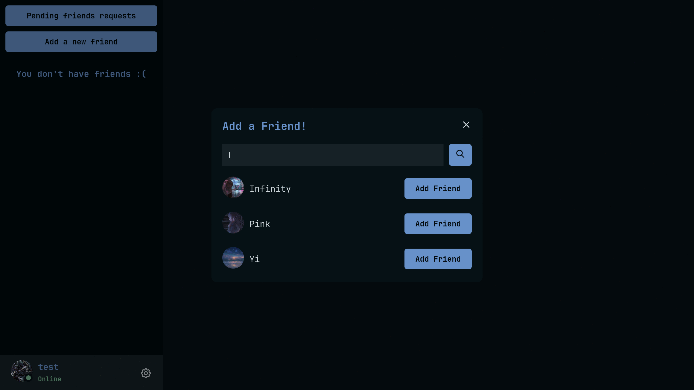

## Real-time chat


This is a real-time chat application created using [Socket.io](https://socket.io) and [Express.js](https://expressjs.com).

This project is an implementation of the WebSocket technology with the help of RESTful APIs.

> [!WARNING]
> This project is not meant to be used on production. It was created just to play around with the real-time technology.

### How to run it?
You need to have [Docker](https://docs.docker.com/get-docker) installed first.

Then just run:
```shell
$ docker compose up
```

And that's it!

### Which features does it has?
- Account system that only requires username and password.
- Friends requests system. You can send a friend request to another user or accept one sent to you.
- Chat in real-time with your friends.
- Avatar can be personalized.
- You can see in real-time if a friend of yours is online.

### Technologies used for this project
I have used [Vite](https://vitejs.dev) and [React.js](https://react.dev) for the frontend.

For the backend, [Express.js](https://expressjs.com) handles the serving of the static files (the users avatars) and all the RESTful API endpoints. Meanwhile [Socket.io](https://socket.io) handles all things that requires changes in our application on real-time.

All the data generated by this application is saved using [MongoDB](https://www.mongodb.com) as the database and [Typegoose](https://typegoose.github.io/typegoose) to help with the management.

